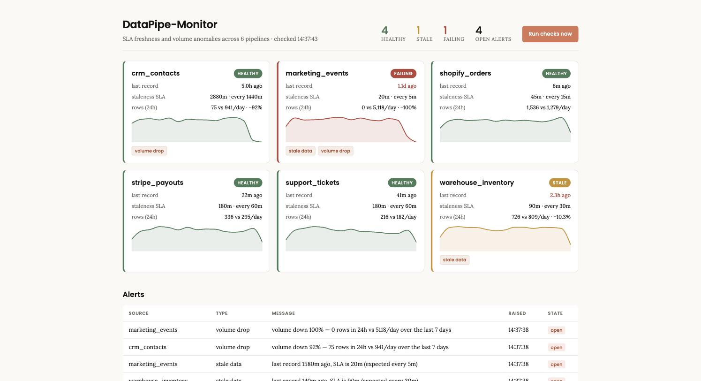

# DataPipe-Monitor

**A pipeline that fails loudly gets fixed. A pipeline that fails silently gets believed.**
The job exits 0, the dashboard still renders, the numbers just quietly stop moving — and
the client is the one who notices, three days later, in a board deck. DataPipe-Monitor
gives every data source an explicit freshness SLA, checks it on a schedule, and raises
exactly one alert when the SLA is breached — plus a volume check that catches the failure
freshness can't see: the job still running on time and writing almost nothing.

## How it flows

```
  pipeline finishes a run
          │  POST /heartbeat/{source_id}  {"row_count": 1400}
          ▼
   Source.last_record_at = now, Heartbeat row appended
          │
          ▼
   APScheduler — every 60s, both checks over every source
          │
          ├─ checks/freshness.py   age = now - last_record_at
          │      age <= SLA ................ healthy
          │      age >  SLA ................ stale
          │      age >  2x SLA ............. failing
          │
          └─ checks/volume.py      trailing 24h rows vs 7-day daily average
                 drop >= 40% ............... volume_drop
          │
          ▼
   alerting/notify.py — open_alert() / resolve_alert()
          │  one open alert per (source, type), however many passes breach
          ▼
   Slack webhook when configured, log line otherwise
          │
   source recovers → next pass resolves the alert, no one clicks anything
```

## Why SLA freshness is the trust builder

"Is the data fresh?" has no answer until someone writes down what fresh means for each
source. An hourly ETL silent for 90 minutes is a problem; a nightly CRM export silent for
90 minutes is fine. So every source declares two numbers up front —
`expected_interval_minutes` and `max_staleness_minutes` — and every alert quotes them
back:

```
last record 140m ago, SLA is 90m (expected every 30m)
```

Three things make that trustworthy rather than noisy:

1. **One alert per breach, not one per check pass.** The scheduler runs every 60 seconds.
   A source down for six hours breaches 360 times and raises one alert — de-duplication
   lives in `open_alert()`, so no check can forget it.
2. **Escalation is automatic.** Past twice the staleness budget a source isn't late, it's
   down, and the status changes from `stale` to `failing` without anyone re-triaging it.
3. **Recovery closes the loop.** When data lands again the next pass resolves the alert
   and stamps `resolved_at`. Nobody clears a stale red banner by hand, which is how
   dashboards stop being believed.

And the volume check covers the case freshness structurally cannot: `crm_contacts`
delivering on the hour, every hour, with 2 rows instead of 60. Freshness sees a healthy
source. The 7-day rolling average sees an 81% drop.

## What it looks like running

```bash
python demo.py   # six scenes against a real database, no server, no network
pytest -q        # the core feature, asserted
```



<details>
<summary><b>Full <code>demo.py</code> output</b> — healthy baseline, SLA breach, escalation, recovery, silent volume collapse</summary>

```
DataPipe-Monitor — SLA freshness + volume anomaly detection
Live run against a real database. No network calls.

──────────────────────────────────────────────────────────────────────────────
SCENE 1 — Two sources register their SLA
Each declares how often it should deliver and how late is too late.

  shopify_orders         every   15m   SLA 45m
  crm_contacts           every   60m   SLA 180m

──────────────────────────────────────────────────────────────────────────────
SCENE 2 — Eight days of normal deliveries
Both pipelines run on schedule. This is the baseline every check compares to.

  shopify_orders         healthy  last record    10m ago   open: -
  crm_contacts           healthy  last record    30m ago   open: -

──────────────────────────────────────────────────────────────────────────────
SCENE 3 — shopify_orders stops delivering
60 minutes of silence against a 45-minute SLA. One alert, not a storm:

  shopify_orders         stale    last record    70m ago   open: stale_data
  crm_contacts           healthy  last record    90m ago   open: -

  4 check passes while breaching -> 1 open alert
  "last record 70m ago, SLA is 45m (expected every 15m)"

──────────────────────────────────────────────────────────────────────────────
SCENE 4 — Still nothing, two hours later
Past 2x the SLA a source isn't late, it's down. Status escalates on its own.

  shopify_orders         failing  last record   150m ago   open: stale_data
  crm_contacts           healthy  last record   170m ago   open: -

──────────────────────────────────────────────────────────────────────────────
SCENE 5 — The backfill lands
Recovery closes the alert without anyone clicking anything.

  shopify_orders         healthy  last record     0m ago   open: -
  crm_contacts           healthy  last record   171m ago   open: -

  alerts auto-resolved: 1

──────────────────────────────────────────────────────────────────────────────
SCENE 6 — The silent failure — crm_contacts keeps its heartbeat
An upstream filter breaks. The job still runs on time, it just writes almost
nothing. Freshness sees a healthy source; the volume check sees the truth.

  freshness says:  healthy  (delivered on the hour, every hour — nothing to see)
  volume says:     46 rows in 24h vs 249/day baseline -> 81% down

  alert raised:    "volume down 81% — 46 rows in 24h vs 249/day over the last 7 days"

──────────────────────────────────────────────────────────────────────────────
FINAL STATE

  shopify_orders         healthy  last record     0m ago   open: -
  crm_contacts           healthy  last record     0m ago   open: volume_drop

  2 alert(s) total, 1 resolved, 1 open

Every assertion above passed.

```

</details>

## Run it

```bash
python3.11 -m venv .venv && source .venv/bin/activate
pip install -r requirements.txt

cp .env.example .env        # Postgres. Delete DATABASE_URL to fall back to SQLite.
createdb datapipe_monitor   # only if you kept Postgres

python seed.py              # 6 sources, 14 days of heartbeats, 4 live alerts
uvicorn app.main:app --reload --port 8010
```

Then open <http://localhost:8010>. The dashboard polls `/health` every 15 seconds; **Run
checks now** forces a pass instead of waiting for the scheduler.

Watch a recovery end to end:

```bash
curl -s localhost:8010/sources                 # seed.py prints these ids too
curl -X POST localhost:8010/heartbeat/<warehouse_inventory id> \
     -H 'content-type: application/json' -d '{"row_count":210}'
curl -X POST localhost:8010/checks/run
```

`warehouse_inventory` goes stale → healthy and its alert flips to resolved in the table.

## API

| | |
|---|---|
| `POST /sources` | register a source with its SLA — `{name, expected_interval_minutes, max_staleness_minutes}` |
| `POST /heartbeat/{source_id}` | a pipeline reporting a completed run — `{row_count}` |
| `GET /health` | everything the dashboard draws: status, freshness, volume, 14-day sparkline |
| `GET /alerts?resolved=false` | alert history, newest first |
| `POST /checks/run` | force a check pass |

Interactive docs at `/docs`.

## Layout

```
app/
  main.py               FastAPI, APScheduler wiring, Sentry, the /health payload
  models.py             Source, Heartbeat, Alert  (SQLModel)
  checks/freshness.py   the SLA check — pure evaluate() + the pass that persists it
  checks/volume.py      trailing 24h vs 7-day average
  alerting/notify.py    open/resolve/de-duplicate, then Slack or log
frontend/index.html     React + Recharts dashboard, one file, no build step
tests/test_checks.py    breach -> one alert -> escalation -> recovery, and the volume drop
demo.py  seed.py
```

## Deliberate limits

Portfolio prototype, so: the dashboard is one file served straight off FastAPI rather
than a bundled SPA, notifications are Slack-or-log (no SMTP), and `POST /sources` /
`/heartbeat` are unauthenticated — a real deployment gives each pipeline a token. The
scheduler is single-process; two API replicas would run the checks twice.
