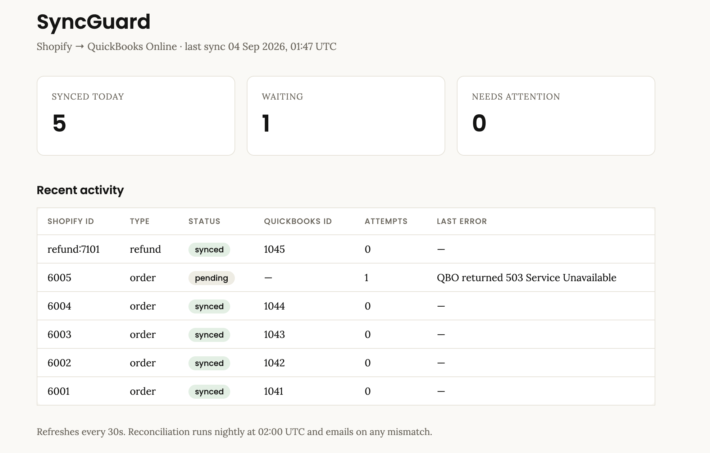

# SyncGuard

**A store owner reconciling Shopify against QuickBooks by hand catches errors weeks
late, if at all — by then the fix means adjusting closed books.** SyncGuard syncs every
Shopify order to a QuickBooks Online sales receipt in near real time, guarantees it can
never create a duplicate no matter how many times Shopify retries a webhook, and checks
every night that the two systems still agree — so drift is a same-day alert, not a
quarter-end surprise.

## What it looks like running



The owner-facing view: what synced today, what is still waiting, what needs a human.
Order `6005` is mid-retry after a QuickBooks outage — visible, not lost.

Reproduce it locally in under a second, no credentials and no network:

```bash
python demo.py            # 7 scenes, every one asserts its outcome
python seed_dashboard.py  # fills the dashboard with sample activity
```

<details>
<summary><b>Full <code>demo.py</code> output</b> — duplicate storms, forged webhooks, fee splitting, partial refunds, outage backoff, reconciliation drift</summary>

```
SyncGuard — Shopify → QuickBooks Online sync engine
Live run against a real SQLite ledger and a stubbed QuickBooks. No network calls.

──────────────────────────────────────────────────────────────────────────────
SCENE 1 — Duplicate webhook storm
Shopify resends a webhook on any slow or non-200 response. A naive integration books a second invoice every time.

  delivery 1: HTTP 200  already_queued=False
  delivery 2: HTTP 200  already_queued=True
  delivery 3: HTTP 200  already_queued=True
  delivery 4: HTTP 200  already_queued=True
  delivery 5: HTTP 200  already_queued=True
  ✓ 5 identical deliveries → 1 ledger row → 1 QuickBooks sales receipt
  ✓ enforced by UNIQUE(source_system, source_id) in the database, not by an if-statement

──────────────────────────────────────────────────────────────────────────────
SCENE 2 — Forged webhook
Your endpoint is public. Anything that can POST to it can invent revenue.

{"component": "webhook", "topic": "orders/create", "event": "webhook_hmac_invalid", "level": "warning", "timestamp": "2026-09-04T01:56:10.745591Z"}
  ✓ wrong HMAC signature → HTTP 401, rejected before any database write

──────────────────────────────────────────────────────────────────────────────
SCENE 3 — Payout fees kept off the revenue line
Shopify deducts its fee before the payout lands. Netting it into revenue understates gross sales.

  Widget                               100.00  → account 79
  Shopify payout processing fee          3.20  → account 80
  ✓ revenue posts at gross 100.00; the 3.20 fee is its own line on the expense account

──────────────────────────────────────────────────────────────────────────────
SCENE 4 — Partial refunds
Two partial refunds against one order, then one that would over-refund it.

  SHOPIFY-REFUND-7001             30.00
  SHOPIFY-REFUND-7002             40.00
  ✓ 70.00 of 100.00 refunded as two QBO RefundReceipts linked to the original
{"component": "worker", "source_id": "refund:7003", "kind": "refund", "error": "refund 50.0 + already_refunded 70.0 exceeds order total 100.0", "attempts": 1, "status": "pending", "event": "sync_failed", "level": "error", "timestamp": "2026-09-04T01:56:10.754166Z"}
  ✗ third refund of 50.00 rejected: refund 50.0 + already_refunded 70.0 exceeds order total 100.0
  ✓ over-refund never reaches QuickBooks; it is held on the ledger for a human

──────────────────────────────────────────────────────────────────────────────
SCENE 5 — QuickBooks outage → backoff → dead letter → replay
An outage must not silently drop an order.

{"component": "worker", "source_id": "5002", "kind": "order", "error": "QBO returned 503 Service Unavailable", "attempts": 1, "status": "pending", "event": "sync_failed", "level": "error", "timestamp": "2026-09-04T01:56:10.756919Z"}
  attempt 1: status=pending  next retry in 60s
{"component": "worker", "source_id": "5002", "kind": "order", "error": "QBO returned 503 Service Unavailable", "attempts": 2, "status": "pending", "event": "sync_failed", "level": "error", "timestamp": "2026-09-04T01:56:10.758183Z"}
  attempt 2: status=pending  next retry in 120s
{"component": "worker", "source_id": "5002", "kind": "order", "error": "QBO returned 503 Service Unavailable", "attempts": 3, "status": "pending", "event": "sync_failed", "level": "error", "timestamp": "2026-09-04T01:56:10.759386Z"}
  attempt 3: status=pending  next retry in 240s
{"component": "worker", "source_id": "5002", "kind": "order", "error": "QBO returned 503 Service Unavailable", "attempts": 4, "status": "pending", "event": "sync_failed", "level": "error", "timestamp": "2026-09-04T01:56:10.760525Z"}
  attempt 4: status=pending  next retry in 480s
{"component": "worker", "source_id": "5002", "kind": "order", "error": "QBO returned 503 Service Unavailable", "attempts": 5, "status": "pending", "event": "sync_failed", "level": "error", "timestamp": "2026-09-04T01:56:10.761834Z"}
  attempt 5: status=pending  next retry in 960s
{"component": "worker", "source_id": "5002", "kind": "order", "error": "QBO returned 503 Service Unavailable", "attempts": 6, "status": "failed", "event": "sync_failed", "level": "error", "timestamp": "2026-09-04T01:56:10.763134Z"}
  attempt 6: status=failed   next retry in —
  ✓ exhausted 6 attempts with exponential backoff → dead-lettered, not lost

  QuickBooks recovers; operator replays the dead letter:
  $ curl -X POST localhost:8001/sync/replay/5002 → {'source_id': '5002', 'status': 'pending', 'attempts': 0}
  ✓ replayed and synced — the order the outage nearly ate is now in QuickBooks

──────────────────────────────────────────────────────────────────────────────
SCENE 6 — Nightly reconciliation
Idempotency stops duplicates. Only reconciliation catches what never arrived.

{"component": "reconcile", "date": "2026-09-04", "shopify_order_count": 3, "qbo_synced_count": 2, "missing_source_ids": ["5003"], "dead_lettered_source_ids": [], "drift": true, "event": "reconciliation_drift_detected", "level": "warning", "timestamp": "2026-09-04T01:56:10.766309Z"}
{"component": "reconcile", "body": "SyncGuard reconciliation drift for 2026-09-04\nShopify orders: 3\nQBO synced:     2\n\nMissing source_ids (1):\n  - 5003\n\nDead-lettered source_ids (0):", "event": "reconciliation_alert_email_not_configured_logging_instead", "level": "warning", "timestamp": "2026-09-04T01:56:10.766325Z"}
  Shopify orders yesterday : 3
  QuickBooks synced        : 2
  Missing                  : ['5003']
  Dead-lettered            : —
  ✗ drift detected → alert email sent (logged when SMTP is unconfigured)
  ✓ a missed order surfaces the next morning instead of at quarter-end

──────────────────────────────────────────────────────────────────────────────
SCENE 7 — Owner-facing status
What a non-technical store owner checks to see it is alive.

  last_sync      2026-09-04T01:56:10.765202
  synced_today   4
  failed         0
  pending        1

  Same numbers rendered at http://localhost:8001/dashboard

──────────────────────────────────────────────────────────────────────────────
All scenes passed. Ledger: demo.db
Inspect it:  sqlite3 demo.db 'select source_id,status,destination_id,attempts from syncrecord'
```

</details>

## The 3 ways these syncs break (and how SyncGuard handles each)

**1. Duplicates.** Shopify resends webhooks aggressively on any non-200 or slow
response — the same order can arrive 2, 5, 10 times. A naive integration creates a
receipt on every delivery. SyncGuard never lets a webhook call QuickBooks directly:
every event is first inserted into the `sync_record` ledger table under a
`UNIQUE(source_system, source_id)` constraint (`app/models.py`). The insert uses
`ON CONFLICT` semantics (`app/sync/ledger.py::enqueue`) — whichever delivery wins the
database race gets processed, every other delivery of the same order finds its row
already there and does nothing. This is enforced by the database, not by an `if` in
application code, so it holds even across restarts, crashes mid-request, or two workers
processing at once.

**2. Refunds.** A naive sync either ignores refunds (revenue permanently overstated) or,
worse, treats a refund webhook like an order webhook and creates a second *positive*
receipt. SyncGuard's refund path (`app/sync/refunds.py`, `app/worker.py::process_refund`)
has exactly one exit: a QBO `RefundReceipt` for the exact refunded amount, linked to the
original sales receipt. It tracks cumulative refunds against the order total and rejects
(dead-letters, alerts) any refund that would exceed what was actually charged — partial
refunds are supported and multiple partial refunds against one order are summed
correctly.

**3. Fees.** Shopify Payments deducts a processing fee before the payout hits the bank.
Netting that fee into the revenue line silently understates gross sales — the number a
merchant actually needs for tax and business reporting. SyncGuard always posts the sales
receipt at the full gross amount the customer paid, then adds the fee as its **own line**
against a configured expense account (`app/sync/fees.py`). Revenue and fees are always
two numbers, never one blended one.

## Architecture

```
Shopify ──POST /webhooks/shopify──▶ HMAC verify ──▶ ledger row (pending) ──▶ 200 OK
                                                            │
                                    APScheduler, every 15s  ▼
                                    claim due pending/retry-due rows (atomic UPDATE)
                                                            │
                              order_to_receipt / refunds ──▶ QBO client (OAuth2 refresh)
                                                            │
                                          mark synced (dest_id) or backoff/dead-letter
                                                            │
                                    APScheduler, nightly ──▶ reconcile: Shopify count
                                                              vs QBO-synced count
                                                              ──▶ alert on drift
```

No message broker — the ledger table **is** the queue. This is deliberately the
smallest architecture that gives real exactly-once guarantees: one Postgres table, one
unique constraint, one poller. Add Celery/Redis only if throughput ever exceeds what a
single poller claiming batches of 20 rows every 15s can drain (~thousands of orders/hour
per instance), and even then Postgres advisory locks or `SKIP LOCKED` (already used here)
scale further before a broker is needed.

## The ledger — the centerpiece

```python
class SyncRecord(SQLModel, table=True):
    __table_args__ = (UniqueConstraint("source_system", "source_id"), ...)
    source_system: str        # "shopify"
    source_id: str             # Shopify order id, or "refund:<refund_id>"
    destination_id: str | None # QBO receipt id, once synced
    status: str                 # pending | synced | failed | skipped
    attempts: int
    last_error: str | None
    next_attempt_at: datetime   # exponential backoff target
```

Every webhook, before touching QuickBooks, does exactly one thing: try to insert a row
here. If the row already exists, stop — the event was already seen, whether that's a
literal duplicate delivery or a crash-recovery retry. If QBO itself is later found to
already have a receipt for this `source_id` (e.g. the process died after creating it but
before writing `destination_id`), `qbo_client.py::find_receipt_by_doc_number` recovers by
lookup instead of creating a second one. **This one table is why a webhook retry storm
can never turn into a duplicate invoice.**

## Reconciliation — why this justifies an ongoing retainer

Idempotency prevents duplicates; it does nothing for an order that *never arrived* — a
missed webhook, a QBO outage that exhausted retries and dead-lettered a record, a scope
change that silently breaks the Shopify token. Those failures are invisible until
someone notices the books don't match, usually much later.

`app/reconcile/nightly.py` runs every night at `RECONCILE_HOUR_UTC`: it pulls Shopify's
own order count for the prior day, compares it against ledger rows marked `synced` for
that day, and lists every `source_id` present in Shopify but missing from QBO, plus any
dead-lettered records. If there's any drift it emails a report (or logs it, if SMTP isn't
configured) same-day. **This is the check that turns "we think the sync is working" into
"we know it is, every single morning" — the concrete deliverable a client is paying an
ongoing retainer for.**

## API

| Endpoint | Purpose |
|---|---|
| `POST /webhooks/shopify` | HMAC-verified order/refund ingestion. Always returns fast; QBO calls happen out-of-band. |
| `GET /sync/status` | `{last_sync, synced_today, failed, pending}` |
| `POST /sync/replay/{source_id}` | Reset a dead-lettered record to `pending` for reprocessing |
| `GET /dashboard` | Owner-facing status page: last sync, synced today, anything needing attention, recent activity |
| `GET /health` | Liveness/readiness (DB ping) |

## Setup

### 1. Local dependencies

```bash
cd syncguard
python3.12 -m venv .venv && source .venv/bin/activate   # 3.11+ required; psycopg2-binary has no 3.14 wheel yet
pip install -r requirements.txt
cp .env.example .env   # fill in as below
```

### 2. Get sandbox credentials

| Variable | Where to get it |
|---|---|
| `SHOPIFY_WEBHOOK_SECRET` | Shopify Partners → dev store → Settings → Notifications → Webhooks (signing secret), or custom app → API credentials → API secret key |
| `SHOPIFY_STORE_DOMAIN` | `your-store.myshopify.com` |
| `SHOPIFY_ADMIN_TOKEN` | Custom app → API credentials → Admin API access token, scope `read_orders` |
| `QBO_CLIENT_ID` / `QBO_CLIENT_SECRET` | developer.intuit.com → your app → Keys & credentials → Development |
| `QBO_REALM_ID` | developer.intuit.com sandbox company → Company ID |
| `QBO_REFRESH_TOKEN` | developer.intuit.com → OAuth 2.0 Playground → scope `com.intuit.quickbooks.accounting` |
| `QBO_INCOME_ACCOUNT_ID`, `QBO_FEE_ACCOUNT_ID`, `QBO_CLEARING_ACCOUNT_ID` | Run `python -m app.clients.qbo_client --list-accounts` once the vars above are set |
| `SENTRY_DSN` (optional) | sentry.io → new Python project |
| `SMTP_*` / `ALERT_EMAIL_TO` (optional) | Any SMTP provider; reconciliation logs the report instead if unset |

All of the above are free-tier / sandbox — nothing here costs money.

### 3. Run locally (no Docker required)

SQLite is the default database — nothing to install, no container runtime:

```bash
echo 'DATABASE_URL=sqlite:///./syncguard.db' >> .env
uvicorn app.main:app --reload        # http://localhost:8000/dashboard
```

`docker compose up` (Postgres + app) is available if you have Docker, and Postgres is
what the deploy targets use — but every table, query and constraint in this project runs
identically on SQLite, so local development and the full demo need neither.

Register the webhook in your Shopify dev store (Settings → Notifications, or via API)
pointing at `https://<your-host>/webhooks/shopify` for topics `orders/create`,
`orders/updated`, `orders/paid`, `refunds/create`.

### 4. Test

```bash
pytest -q     # 17 tests, no network required — covers idempotency, refunds, fees, HMAC
```

### 5. See it work end to end

```bash
python demo.py
```

Drives the real webhook → ledger → worker → QuickBooks path against a throwaway SQLite
file and a stubbed QuickBooks, with no credentials and no network. Seven scenes, each
asserting its outcome:

| Scene | What it proves |
|---|---|
| Duplicate webhook storm | 5 identical deliveries → 1 ledger row → 1 sales receipt |
| Forged webhook | Bad HMAC → `401`, rejected before any database write |
| Payout fees | Revenue posts at gross; the fee is its own expense line |
| Partial refunds | Two partials sync; the one that would over-refund is blocked |
| QuickBooks outage | 6 backoff attempts → dead letter → `POST /sync/replay` → synced |
| Nightly reconciliation | An order that never arrived is named in a drift alert |
| Owner status | `/sync/status` and `/dashboard` numbers |

The script exits non-zero if any guarantee breaks, so it doubles as the end-to-end
regression check.

## Deploy

**Render** (recommended, `render.yaml` included):

```bash
# push repo to GitHub, then in the Render dashboard:
# New → Blueprint → point at the repo → it reads render.yaml
# fill in the sync:false env vars in the dashboard once
```

**Railway**:

```bash
railway init
railway add --database postgres
railway up
railway variables set SHOPIFY_WEBHOOK_SECRET=... QBO_CLIENT_ID=... # etc.
```

Either way: set `DATABASE_URL` to the managed Postgres connection string, set every
variable from the table above, and confirm `GET /health` returns `200` post-deploy.

## Production checklist (implemented)

- [x] HMAC signature verification, constant-time compare, reject before any DB write
- [x] OAuth2 refresh-token handling for QBO (lazy refresh + 401 retry-once)
- [x] Exponential backoff (`30s * 2^attempts`, capped at 6h) + dead-letter after 6 attempts
- [x] `POST /sync/replay/{source_id}` to recover dead-lettered records
- [x] Structured JSON logs with `source_id` bound on every worker/webhook log line
- [x] Sentry integration (opt-in via `SENTRY_DSN`)
- [x] All secrets via `.env`, never hardcoded or logged
- [x] Idempotent ledger insert + idempotent QBO create (lookup-before-create recovery)
- [x] `/health` endpoint for platform liveness checks

## Live demo

_deploy URL to be added once pointed at a real Shopify dev store._

Until then, `python demo.py` reproduces every guarantee above locally in under a second.
